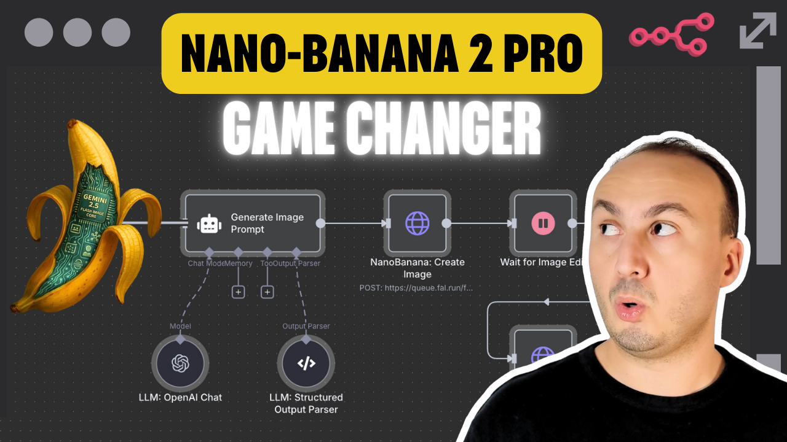

# Create AI Viral Videos using NanoBanana 2 PRO & VEO3.1 and Publish via Blotato

Advanced n8n automation for Create AI Viral Videos using NanoBanana 2 PRO & VEO3.1 and Publish via Blotato.

## Overview
- Category: Content Creation, Multimodal AI
- Complexity: advanced
- Source: n8n workflow template export

## What This Automation Does
Effortlessly turn a Telegram message into viral AI videos with NanoBanana 2 PRO, VEO3.1 & Blotatofully automated, multi-platform, and customizable.

## Included Files
- `workflow.json`

## Setup
1. Import `workflow.json` into n8n.
2. Configure required credentials for the services used in the workflow nodes.
3. Update any environment variables or static values inside nodes (API keys, URLs, IDs).
4. Run a test execution and then activate the workflow.

## Tech Stack

- `@blotato/n8n-nodes-blotato.blotato`
- `@n8n/n8n-nodes-langchain.agent`
- `@n8n/n8n-nodes-langchain.lmChatOpenAi`
- `@n8n/n8n-nodes-langchain.openAi`
- `@n8n/n8n-nodes-langchain.outputParserStructured`
- `@n8n/n8n-nodes-langchain.toolThink`
- `n8n-nodes-base.code`
- `n8n-nodes-base.httpRequest`
- `n8n-nodes-base.merge`
- `n8n-nodes-base.set`
- `n8n-nodes-base.stickyNote`
- `n8n-nodes-base.telegram`
- `n8n-nodes-base.telegramTrigger`
- `n8n-nodes-base.wait`

## Author

Murtaza Baig

## Screenshots

## License
MIT License. See `LICENSE`.